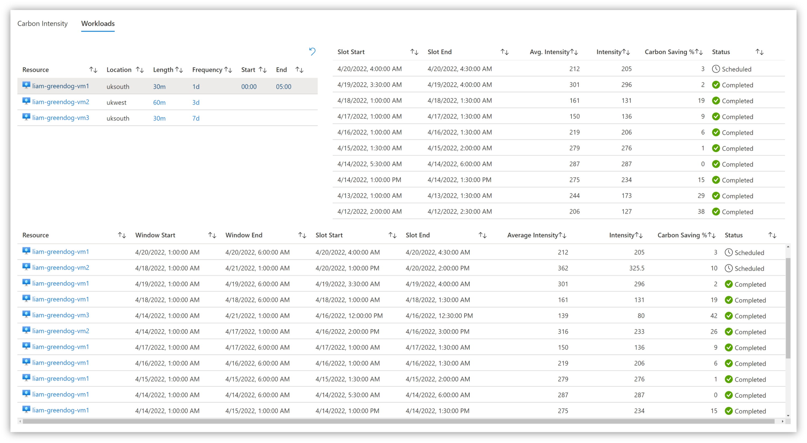

# Carbon Shift

Carbon Shift is a solution for scheduling your Azure workloads to run at intervals where carbon intensity is at its lowest.

## Description
Carbon Shift revolves around an Azure Automation account that uses the [Carbon Intensity API](https://www.carbonintensity.org.uk/) to gather the UK's forecast for carbon intensity and schedule your Azure workloads based on the configuration of your Azure environment. The overall goal is to shift the execution of certain workloads from a period where carbon intensity may be high to that where we know it is at its lowest.

## Tags

| Tag Name | Tag Value | Description | Required? |
--- | --- | --- | --- 
| csLength | <600m | Value in minutes to the nearest hour of how long the workload runs for | Yes
| csFrequency | 1d, 1w, 1m, 1q | How often the workload will be scheduled | Yes 
| csLastRun | 2022-03-01 03:00 | Datestamp of when the workload last run | No
| csFluid | true/false | Boolean value on if the workload can be moved if CI is better in the other region | No
| csStartTime | 00:00 | When should this workload be run? | No
| csEndTime | 00:00 | When should this workload be run? | No

## To-Do
* [x] Find VMs using Azure Tags
* [x] Create Azure Automation Schedules via Azure Tags
* [x] Log Data to Log Analytics Workspace
* [x] Create Azure Workbook for Carbon Telemetry
* [x] Create logic to calculate dates greater than 3 days
* [ ] Look into other workloads (WVD, Batch, Azure Functions)
* [ ] Finalise Azure Bicep Template

## How to Use
Until the Azure Bicep template is ready, you'll need to deploy:
- An Automation Account with a Managed Identity
- A Log Analytics Workspace

### Automation Account
- Assign the Automation Account 'Virtual Machine Contributor' to the scope you are wanting to use Carbon Shift with.
- Assign the Automation Account 'Log Analytics Contributor' to the Log Analytics Workspace.
- Create three variables within the Automation Account:
    | Name | Value |
    --- | --- |
    | AA_SUB | The subscription the Automation Account is in |
    | LAW_Name | The name of the Log Analytics Workspace |
    | LAW_RG | The Resource Group name of the Log Analytics Workspace |
- Ensure the modules __Az.ResourceGraph__ and __Az.Accounts__ are the latest available version
- Create two runbooks; CI-runner with the contents of the ```scheduler.ps1``` file in and CI-controller with the contents of the ```controller.ps1``` file in.
- Create two schedules to execute CI-runner every hour with one on the hour and one on the half-hour.
- Manually execute the CI-runner runbook to confirm the set up for the environment is correct.

### Azure Workbook
- Create a new Azure Workbook.
- Go to code view and paste in the contents of ```workbook.json``` into the new workbook. Save this workbook.

## Screenshots

