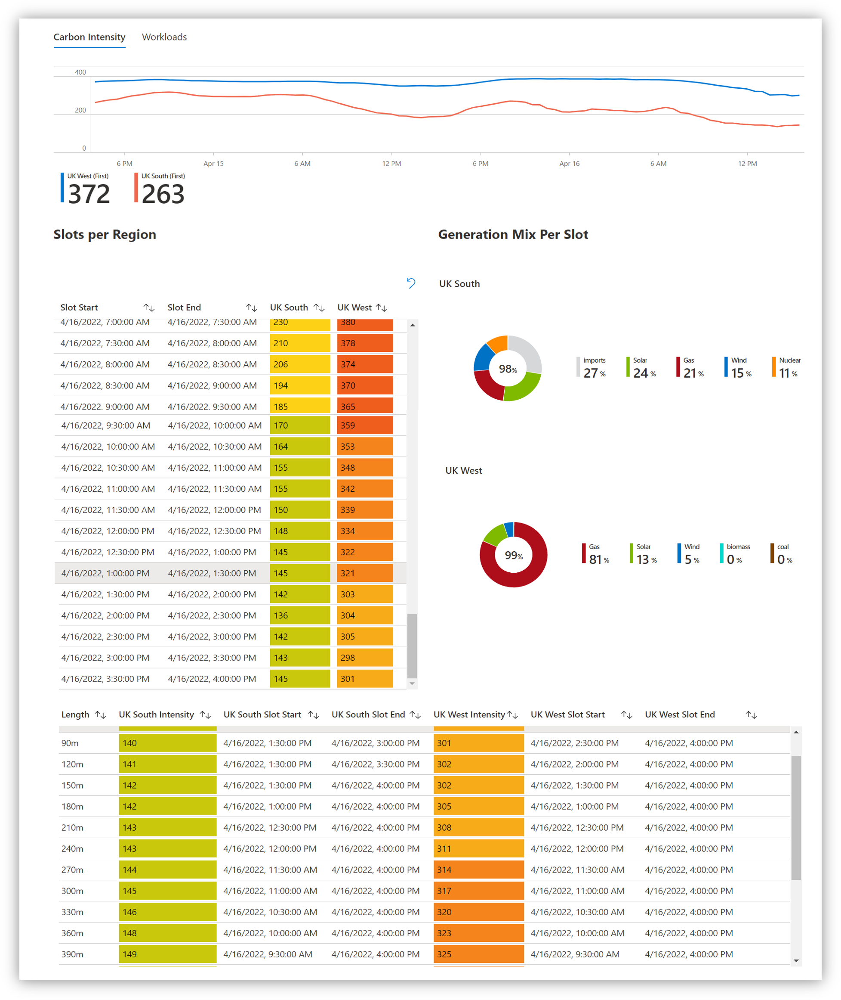

# Carbon Shift

Carbon Shift is a solution for scheduling your Azure workloads to run at during intervals where carbon intensity is at it's lowest.

## Description
Carbon Shift revolves around an Azure Automation account that uses the [Carbon Intensity API](https://www.carbonintensity.org.uk/) to gather the UK's forecast for Carbon Intensity and schedule your Azure workloads based on the configuration of your Azure environment. The overall goal is to shift the execution of certain workloads from a period where carbon intensity may be high to that where we know it is at it's lowest.

## Tags

| Tag Name | Tag Value | Description | Required? |
--- | --- | --- | --- 
| csLength | <600m | Value in minutes to the nearest hour of how long the workload runs for | Yes
| csFrequency | 1d, 1w, 1m, 1q | How often the workload will be scheduled | Yes 
| csLastRun | 2022-03-01 03:00 | Datestamp of when the workload last run | No
| csFluid | true/false | Boolean value on if the workload can be moved if CI is better in the other region | No
| csStartTime | 00:00 | When should this workload be run? | No
| csEndTime | 00:00 | When should this workload be run? | No

## To-Do
* [ * ] Find VMs using Azure Tags
* [ * ] Create Azure Automation Schedules via Azure Tags
* [ * ] Log Data to Log Analytics Workspace
* [ * ] Create Azure Workbook for Carbon Telemetry
* [ * ] Create logic to calculate dates greater than 3 days
* [ ] Look into other workloads (WVD Coldstart, Batch)
* [ ] Finalise Azure Bicep Template

## Screenshots
